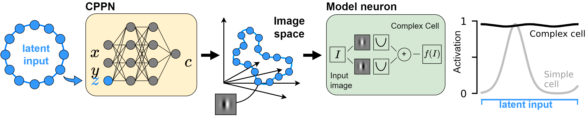

# Learning Invariance Manifold via CPPNs

We present a systematic data-driven approach based on implicit image representations and contrastive learning, that allows the identification and parameterization of the manifold of highly activating stimuli, for visual sensory neurons.

  

You can read the full paper [here](https://openreview.net/forum?id=2dQyENiU330).

**Note**: The repo will be complete (including code and example notebooks) in the coming days. For now, the links below will not work, but they provide an overview of what will be provided once the repo is completed.

## Requirements

This project requires that you have the following installed:

- [docker](https://docs.docker.com/get-docker/)
- [docker-compose](https://docs.docker.com/compose/install/)

## Model

We tested our method on simple Gabor-based model neurons with known (and exact) invariances as well as neural network models predicting the responses of macaque V1 neurons. The Gabor-based models can be readily created and be used to test the method (see [`simulated_neurons.ipynb`]()).
